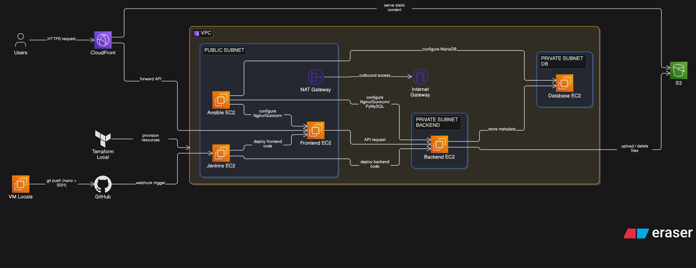

# 📁 File Upload — AWS 3-Tier Architecture
### Terraform · Ansible · Jenkins · Python/Flask

Application web de gestion de fichiers (upload, listing, renommage, suppression) déployée sur une architecture AWS 3-tier complète, entièrement provisionnée en Infrastructure as Code et automatisée de bout en bout.

Ce projet démontre un flux DevOps réaliste : **Terraform** (infrastructure) → **Ansible** (configuration des serveurs) → **Jenkins** (déploiement continu du code applicatif).

---

## 🏗️ Architecture



**Réseau (VPC `10.0.0.0/16`, région `ca-central-1`)**

| Composant | Détail |
|---|---|
| Sous-réseau public | `10.0.1.0/24` — Frontend, serveur Ansible (bastion), Jenkins |
| Sous-réseau privé (backend) | `10.0.2.0/24` — Serveur applicatif backend |
| Sous-réseau privé (database) | `10.0.3.0/24` — MariaDB |
| Internet Gateway | Accès entrant/sortant du sous-réseau public |
| NAT Gateway | Accès sortant uniquement pour les sous-réseaux privés (mises à jour système) |

**Flux applicatif**

```
Utilisateur → CloudFront → Frontend (Flask) → Backend (Flask) → S3 (fichiers)
                                                              → MariaDB (métadonnées)
```

Le frontend et le backend communiquent en interne via leurs adresses IP privées. Aucune instance privée n'est directement accessible depuis internet — tout accès administratif transite par le serveur Ansible, qui joue le rôle de bastion/jump host.

---

## 🧰 Stack technique

| Couche | Technologie |
|---|---|
| Infrastructure as Code | Terraform |
| Configuration management | Ansible (+ Ansible Vault pour les secrets) |
| CI/CD | Jenkins (pipeline déclaratif) |
| Backend | Python 3.12, Flask, Gunicorn, boto3, PyMySQL |
| Frontend | Python 3.12, Flask, Gunicorn, Jinja2 |
| Reverse proxy | Nginx |
| Base de données | MariaDB 10.11 |
| Stockage fichiers | Amazon S3 (accès public bloqué) |
| CDN | Amazon CloudFront (Origin Access Control) |
| Contrôle de version | Git / GitHub |

---

## 🔐 Sécurité — choix de conception

- **IAM Role + Instance Profile** sur le backend (pas de clés d'accès AWS en dur dans le code) — permissions restreintes à `s3:PutObject`, `s3:GetObject`, `s3:DeleteObject` sur le bucket du projet uniquement
- **Security Groups en liste blanche stricte** : le backend et la base de données n'acceptent le trafic entrant que depuis les security groups autorisés (frontend, ansible, jenkins) — jamais depuis `0.0.0.0/0`
- **Bucket S3 privé** avec accès public entièrement bloqué ; seul CloudFront (via OAC) peut lire son contenu
- **Secrets de base de données chiffrés** avec Ansible Vault — jamais en clair dans le dépôt Git
- **Requêtes SQL préparées** (paramètres liés) pour prévenir les injections SQL
- **Validation du type MIME réel** des fichiers uploadés (pas seulement l'extension)
- **Clé SSH dédiée** au projet, gérée séparément de toute autre clé personnelle
- **Historique Git propre** : aucun secret (mots de passe, clés privées) n'a jamais été commité, grâce à un `.gitignore` construit progressivement et rigoureusement

---

## 🚀 Déploiement

### Prérequis
- Compte AWS avec CLI configuré
- Terraform ≥ 1.5
- Ansible ≥ 2.16
- Une paire de clés SSH dédiée au projet

### 1. Provisionner l'infrastructure

```bash
cd terraform
terraform init
terraform plan
terraform apply
```

### 2. Configurer les serveurs

```bash
cd ../ansible
cp inventory.ini.example inventory.ini
# Renseigner les IP privées obtenues via terraform output
ansible-playbook -i inventory.ini playbooks/setup.yml --ask-vault-pass
```

### 3. Déployer le code applicatif

Le déploiement est automatisé par Jenkins : chaque exécution du job `deploy-3tier-app` récupère la dernière version du code sur GitHub et la déploie sur les serveurs frontend et backend via SSH, puis redémarre les services `systemd` correspondants.

---

## 🧪 API Backend

| Méthode | Route | Description |
|---|---|---|
| `POST` | `/upload` | Upload d'un fichier (image JPEG/PNG ou PDF) |
| `GET` | `/files` | Liste des fichiers avec leurs métadonnées et URL CloudFront |
| `PUT` | `/files/<id>` | Renomme un fichier (métadonnées uniquement) |
| `DELETE` | `/files/<id>` | Supprime un fichier (S3 + base de données) |

**Interface frontend** — en plus du formulaire d'upload, chaque fichier listé propose : consultation (clic sur le nom), **téléchargement direct**, **renommage**, et suppression.

---

## 🐛 Défis rencontrés et résolus

Cette section documente les problèmes réels rencontrés pendant la construction du projet — une bonne partie du travail d'ingénierie se trouve dans leur diagnostic, pas seulement dans l'écriture initiale du code.

- **Connectivité réseau NAT instable sous VMware Workstation** → bascule vers VirtualBox pour la VM de travail locale, résolvant le problème dès le premier essai.
- **Nommage d'AMI Ubuntu changé** (`hvm-ssd` → `hvm-ssd-gp3`) faisant échouer le data source Terraform — corrigé après vérification directe via `aws ec2 describe-images`.
- **`t2.micro` retiré du Free Tier** par AWS — migration vers `t3.micro` (puis `t3.small` pour Jenkins, plus gourmand en RAM).
- **16 vulnérabilités de sécurité détectées par `composer audit`** sur les dépendances initiales du SDK AWS PHP (avant la bascule vers Python) — corrigées avant de continuer, plutôt qu'ignorées.
- **MariaDB inaccessible depuis le backend** : le service n'écoutait que sur `127.0.0.1` par défaut — corrigé via `bind-address = 0.0.0.0`, automatisé dans Ansible avec un handler de redémarrage conditionnel.
- **Bug d'indentation YAML silencieux** : un bloc `handlers` mal positionné dans le playbook interrompait la liste de tâches sans lever d'erreur de syntaxe — diagnostiqué en inspectant ligne par ligne la structure du fichier.
- **Permission IAM manquante découverte en test** : la suppression de fichiers échouait car le rôle IAM du backend n'incluait initialement que `PutObject`/`GetObject`, pas `DeleteObject`.
- **Rotation de la clé de signature GPG de Jenkins** (fin 2025) : l'ancienne clé documentée était expirée, et un état GPG corrompu (`~/.gnupg`) sur le serveur — laissé par une tentative avortée d'import via serveur de clés — a nécessité un diagnostic manuel approfondi (`gpgv`, `apt-get -o Debug::Acquire::gpgv=true`) avant résolution.
- **Security group mal aligné après migration Nginx** : le backend n'autorisait que le port `8080` alors que Nginx (port `80`) devenait le point d'entrée réel depuis le frontend.
- **Jenkins bloqué par les security groups SSH** lors du premier déploiement automatisé — le security group Jenkins n'était pas encore autorisé sur backend/frontend, corrigé en ajoutant une règle dédiée.
- **Remplacement forcé des 5 instances EC2 par Terraform** : le data source `aws_ami` (`most_recent = true`) a détecté une nouvelle version de l'AMI Ubuntu entre deux sessions de travail, provoquant la destruction et recréation automatique de toutes les instances — effaçant Jenkins, le code déployé, et la base de données. Corrigé en ajoutant `lifecycle { ignore_changes = [ami] }` sur chaque instance, et l'incident a servi de test grandeur nature de la reproductibilité de l'infrastructure : reconstruction complète en quelques dizaines de minutes depuis GitHub et Ansible, sans perte de code source. Le playbook Ansible a été enrichi à cette occasion pour rendre le provisioning applicatif (venv, config, systemd, Nginx) entièrement automatisé plutôt que partiellement manuel.

---

## 📈 Améliorations possibles

- Mettre en place un **AWS WAF** devant CloudFront pour filtrer les attaques OWASP Top 10 (injection, XSS)
- Restreindre l'accès SSH à une IP spécifique plutôt qu'à `0.0.0.0/0` sur le frontend
- Réduire la policy IAM de l'utilisateur Terraform (`AdministratorAccess` → permissions minimales nécessaires)
- Migrer les secrets vers **AWS Secrets Manager** plutôt qu'Ansible Vault
- Migrer les modules Ansible dépréciés (`community.mysql.*` → `ansible.mysql.*`, `apt_repository` → `deb822_repository`)
- Ajouter un certificat HTTPS (ACM) devant le frontend et le backend
- Renommer réellement l'objet dans S3 lors d'une mise à jour (actuellement, seul le nom affiché en base est modifié)
- Provisionner Jenkins lui-même via Terraform de façon plus poussée (agents de build distribués)

---

## 🎓 Ce que j'ai appris

Ce projet a été l'occasion de construire, casser, diagnostiquer et réparer une infrastructure cloud complète de bout en bout — pas seulement suivre un tutoriel. Les incidents rencontrés (réseau, permissions IAM, rotation de clés GPG, bugs Ansible silencieux) ont demandé une méthode de diagnostic rigoureuse : isoler une variable à la fois, vérifier chaque hypothèse avec les outils bas niveau appropriés (`gpgv`, `ss`, `journalctl`, tests Python interactifs) plutôt que de deviner. C'est cette capacité à documenter et résoudre des pannes réelles, plus que la configuration initiale elle-même, qui reflète le mieux une pratique d'ingénierie infrastructure/sécurité solide.

---

## 👤 Auteur

**Anicet Melachio**
Ingénieur Infrastructure — Maîtrise en cybersécurité, Université de Sherbrooke
